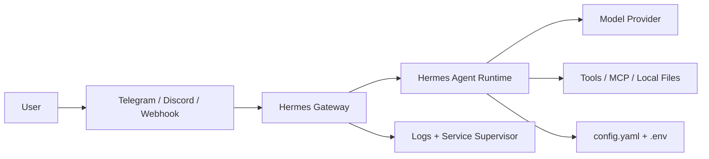

# Hermes Deploy

[](https://github.com/aims1425-lab/hermes-deploy/actions/workflows/ci.yml)
[](https://github.com/aims1425-lab/hermes-deploy/releases)
[](LICENSE)

Hermes Deploy is a production-oriented, self-hosted deployment template for running
[Hermes Agent](https://github.com/NousResearch/hermes-agent) with repeatable setup,
Docker-friendly configuration, security defaults, platform integration examples, and
maintainer documentation.

It is designed for developers, students, and small teams who want to operate Hermes on a
Linux server without rebuilding the same service, security, backup, and troubleshooting
patterns from scratch.

```bash
curl -fsSL https://raw.githubusercontent.com/aims1425-lab/hermes-deploy/main/install.sh | bash
```

## Why this exists

Running an AI agent locally is easy. Keeping it reliable on a server is harder:

- model/provider configuration changes over time;
- Telegram/Discord/webhook integrations need safe token handling;
- long-running gateways need service supervision and restart behavior;
- production installs need `.env` hygiene, health checks, backups, and rollback paths;
- contributors need repeatable validation before changing deployment templates.

Hermes Deploy packages those operational lessons into a public baseline that can be
reviewed, improved, and reused by the community.

## Features

- One-command install flow for Linux servers
- Docker Compose workflow for isolated execution and health checks
- Production-style Hermes configuration template
- Telegram and Discord token-based platform configuration examples
- Systemd user service helper generated by the installer on Linux
- Security-oriented defaults: rate limits, prompt/tool output controls, and secret hygiene
- Maintainer workflow: CI, validation script, release process, roadmap, issue templates
- Troubleshooting and production runbooks under `docs/`

## Architecture



The repository does not ship secrets. Copy `.env.example` to `.env`, fill only the values
you need, and keep real credentials out of Git.

## Quick Start

```bash
# 1. One command install
curl -fsSL https://raw.githubusercontent.com/aims1425-lab/hermes-deploy/main/install.sh | bash

# 2. Configure your model/provider
hermes model

# 3. Start chatting
hermes chat
```

### Docker deployment

```bash
git clone https://github.com/aims1425-lab/hermes-deploy.git
cd hermes-deploy
cp .env.example .env
# Edit .env with your provider/platform tokens
docker compose up -d
```

### Validate before changes

```bash
make validate
```

The validation task checks shell syntax, required governance files, templates, and optional
Docker/YAML checks when those tools are installed, plus local Markdown links across
repository docs.

## Production baseline

This template is intentionally conservative. It gives you a starting point for:

- server bootstrap and repeatable install;
- container/service execution;
- environment-variable based secret loading;
- platform token configuration;
- maintainer-friendly validation;
- troubleshooting and release discipline.

Before exposing a real deployment publicly, review:

- [Production guide](docs/PRODUCTION.md)
- [Security policy](SECURITY.md)
- [Security hardening notes](docs/SECURITY.md)
- [Threat model](docs/THREAT_MODEL.md)
- [Troubleshooting guide](docs/TROUBLESHOOTING.md)

## Repository structure

```text
hermes-deploy/
├── docker-compose.yml      # Container orchestration
├── config.yaml             # Hermes production configuration template
├── .env.example            # Example environment variables only
├── install.sh              # Automated server setup
├── scripts/
│   └── validate.sh         # Repository validation script
├── docs/
│   ├── PRODUCTION.md
│   ├── SECURITY.md
│   ├── THREAT_MODEL.md
│   ├── TROUBLESHOOTING.md
│   ├── MAINTAINER_GUIDE.md
│   ├── RELEASE_PROCESS.md
│   └── CODEX_FOR_OSS_APPLICATION.md
├── .github/
│   ├── workflows/ci.yml
│   ├── ISSUE_TEMPLATE/
│   └── pull_request_template.md
├── LICENSE
├── CONTRIBUTING.md
├── SECURITY.md
├── CODE_OF_CONDUCT.md
├── CHANGELOG.md
├── ROADMAP.md
└── Makefile
```

## Configuration example

```yaml
model:
  default: gpt-4o
  provider: openai

gateway:
  port: 8644
  host: 127.0.0.1
  allowed_user_ids: ["your_telegram_id"]

security:
  rate_limit: 30/minute
  max_turns: 50
  sanitize_tool_output: true

platforms:
  telegram:
    enabled: true
    bot_token: "${TELEGRAM_BOT_TOKEN}"
```

## Deployment options

| Option | Use case |
|--------|----------|
| Docker | Production-like isolation and repeatable updates |
| Direct install | Development or single-user server |
| Systemd user service | 24/7 local gateway supervision |
| Docker + reverse proxy | SSL, webhooks, and multi-agent setups |

## Maintainer workflow

This repository is maintained like a small production operations template:

- changes go through `make validate` and GitHub Actions CI;
- issues and PRs use templates to capture reproducible details;
- release notes are tracked in [CHANGELOG.md](CHANGELOG.md);
- roadmap work is visible in [ROADMAP.md](ROADMAP.md);
- releases follow [docs/RELEASE_PROCESS.md](docs/RELEASE_PROCESS.md);
- security changes are reviewed against [docs/THREAT_MODEL.md](docs/THREAT_MODEL.md).

For OSS support/grant programs, see:

- [docs/CODEX_FOR_OSS_APPLICATION.md](docs/CODEX_FOR_OSS_APPLICATION.md) for the long-form maintainer narrative.

## What is intentionally not included

- Real API keys, bot tokens, OAuth credentials, SSH keys, or customer data
- A hosted SaaS control plane
- A guarantee that one config fits every provider or platform
- Private/commercial agent prompts or business-specific workflows

The goal is a safe public baseline, not a dump of a private production system.

## Contributing

PRs are welcome. Start with:

- [CONTRIBUTING.md](CONTRIBUTING.md)
- [Maintainer guide](docs/MAINTAINER_GUIDE.md)
- [Issue templates](.github/ISSUE_TEMPLATE/)
- [Pull request checklist](.github/pull_request_template.md)

## Credits

Built on [Hermes Agent](https://github.com/NousResearch/hermes-agent) by Nous Research.
This repository focuses on deployment, operations, security hygiene, and maintainer workflow
around Hermes self-hosting.

## License

This project is licensed under the [MIT License](LICENSE).
